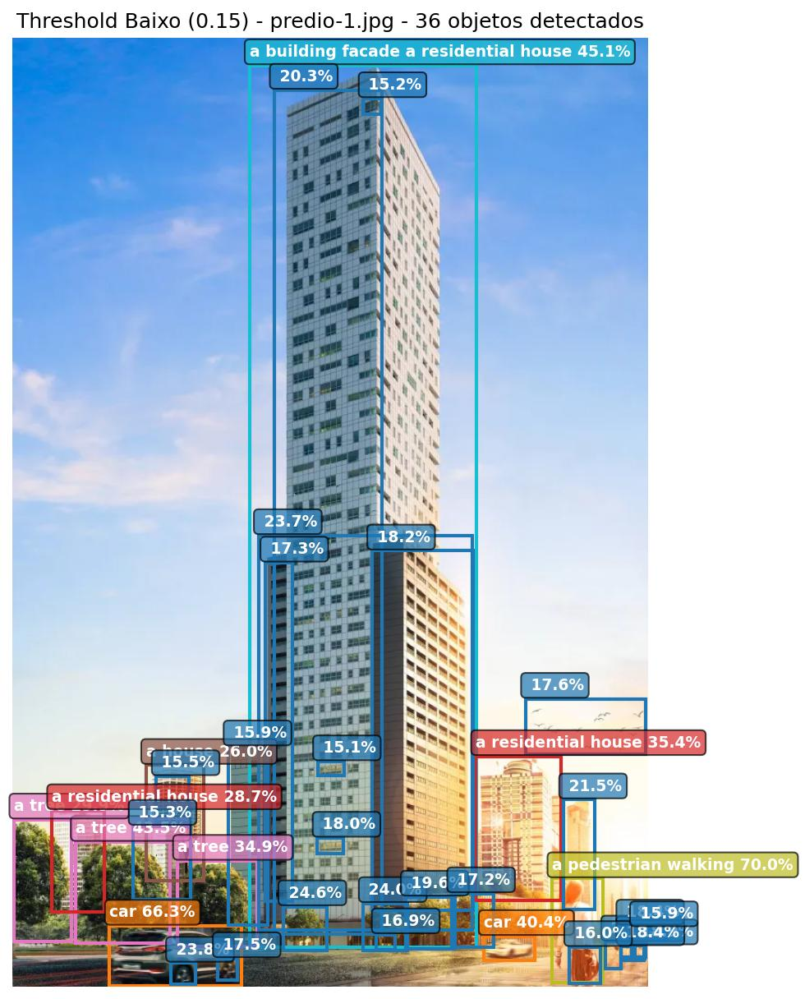

# Detecção Zero-Shot de Objetos com Grounding DINO e IA Generativa Multimodal

      

 

## Sobre o Projeto

Este projeto implementa um sistema avançado de detecção automática de objetos em imagens utilizando a abordagem Zero-Shot Object Detection, fundamentada em modelos generativos de fundação (Foundation Models). A solução foi desenvolvida para identificar e localizar objetos a partir de descrições em linguagem natural (prompts de texto), eliminando a necessidade estatística e operacional de criar ou rotular exaustivos conjuntos de dados para cada nova classe de interesse.

Utilizando a arquitetura multimodal Grounding DINO (Hugging Face), o projeto traduz demandas de visão computacional em um problema de alinhamento entre distribuições espaciais (imagem) e semânticas (texto). A implementação contempla o ciclo completo de um pipeline de inferência, desde a padronização do ambiente e controle de reprodutibilidade até a execução em lote e extração quantitativa de resultados.

---

## Objetivo

- **Inferência Zero-Shot:** Detectar objetos utilizando prompts textuais;
- **Processamento em Lote (Batch Processing):** Processar múltiplas imagens automaticamente;
- **Extração de Dados Quantitativos:** Gerar tensores de resultados contendo as coordenadas espaciais (bounding boxes), classificação textual e, criticamente, as probabilidades associadas (níveis de confiança) para cada detecção.
- **Geração de Relatórios:** Produzir sumarizações estatísticas automatizadas com a contagem de classes e a confiança média dos objetos detectados.

---

## Pipeline Metodológico e Atividades Desenvolvidas

      

 

1. **Definição e Modelagem do Problema:**
   * Análise do custo computacional e do viés amostral no treinamento supervisionado tradicional.
   * Modelagem da solução via transferência de aprendizado Zero-Shot.

2. **Seleção de Arquitetura Multimodal:**
   * Avaliação comparativa de trade-offs entre modelos como YOLO+CLIP, OWL-ViT e Grounding DINO.
   * Seleção do Grounding DINO baseada em sua superioridade na capacidade de generalização e fusão profunda (Feature Enhancer cross-modal).

3. **Padronização e Reprodutibilidade:**
   * Configuração determinística do ambiente PyTorch (fixação de seeds no controle de operações na CPU e tensores na GPU CUDA) para garantir a estabilidade e auditoria dos experimentos.

4. **Engenharia do Pipeline de Inferência:**
   * Construção de um fluxo modular para processamento de matrizes de imagens.
   * Experimentação paramétrica ajustando limiares probabilísticos (Confidence Thresholds) para otimização de falsos positivos e falsos negativos.

5. **Análise de Saída:**
   * Consolidação das predições em arquivos JSON e sumarização analítica das detecções para consumo de dados.

---

## Principais Etapas Desenvolvidas

### Definição do Problema

- Caracterização do cenário de detecção de objetos;
- Identificação das limitações do treinamento supervisionado;
- Definição da abordagem Zero-Shot.

### Seleção do Modelo

- Estudo comparativo de modelos Foundation;
- Escolha do Grounding DINO;
- Fundamentação técnica da arquitetura multimodal.

### Preparação do Ambiente

- Configuração do ambiente Python;
- Instalação das bibliotecas;
- Configuração para utilização de GPU;
- Garantia de reprodutibilidade dos experimentos.

### Desenvolvimento do Pipeline

- Implementação modular;
- Processamento automático de imagens;
- Definição dinâmica de prompts;
- Execução em lote;
- Geração automática das imagens anotadas.

### Avaliação Experimental

- Comparação entre diferentes configurações;
- Ajuste dos limiares de confiança;
- Avaliação qualitativa dos resultados;
- Análise das detecções realizadas.

---

## Competências Técnicas e Estatísticas Demonstradas
- Visão Computacional e Processamento de Linguagem Natural (PLN).
- Inteligência Artificial Generativa e Foundation Models.
- Transformers
- Engenharia de Prompts para tarefas multimodais.
- Desenvolvimento de pipelines de inferência de Deep Learning.
- Controle de estocasticidade e reprodutibilidade de experimentos em PyTorch.
- Otimização e experimentação com Thresholds de Confiança.
- Zero-Shot Learning
- Zero-Shot Object Detection
- Hugging Face

---

## Tecnologias Utilizadas
-   **Linguagem:** Python
-   **Deep Learning Framework:** PyTorch (CUDA 12.1)
-   **Modelos e Hub:** Hugging Face (Transformers, Accelerate), Grounding DINO
-   **Manipulação e Análise de Dados:** NumPy, Pandas
-   **Processamento Visual:** Pillow, Matplotlib, Seaborn
-   **Ambiente:** Jupyter Notebook

---
